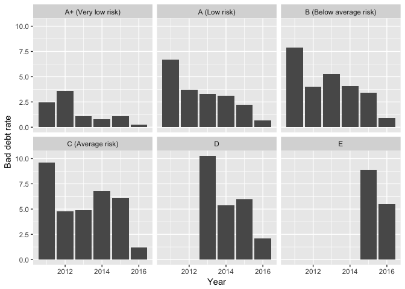

# Estimating the risk of bad debt in the funding circle loanbook

We are again looking at the the peer to peer loan (P2P) book for funding circle (FC), with the focus being the variation in return based on portfolio composition and diversification. FC states that the average return on investment is [6.6%](https://www.fundingcircle.com/uk/statistics/),  with 93% of investors that invested in more than 100 companies, with a maximum exposure of 1% earning 5% or more. The original purpose of this blog was to look at various portfolio's and estimate the risk that they carry for the investor. A key component of this is an understanding of the bad debt rate and it's variation over time, which proved more complex to estimate than expected. This post will be looking in detail at various measures of the bad debt rate and raising questions for future posts.

FC states that the average bad debt rate across all risk categories is 1.8% (after bad debt recovery), and that 42% of all defaulted loans are recovered. Across the platform the average risk of default for each risk band is 0.6% for A+ loans,  1.5%	for A loans, 2.3% for B loans, 3.3% for C loans, 5.0% for D loans, and 8.0% for E loans. In order to optimise a portfolio, that both minimises risk and maximises profit a complete understanding of these risk levels is required.

FC estimates bad debt rates by taking the actual bad debt rate by loan amount, incorporating the estimated bad debt rate for years that have not matured, and then including the expected recoveries that are expected from each year of origination. Whilst the source of these estimates has not been surfaced it is likely that the estimated bad debt for loans that have not matured is estimated from previous years, whilst the the FC statistics page states that average recoveries are 42% of the defaulted amount. 

To explore these assumptions we start by roughly calculating the bad debt rate, looking solely at the number of loans that defaulted in a given year and comparing this to the total number of loans. This is obviously a flawed approach as it does not account for loan size, repayments, recoveries, or the maturity of the loan. However it represents a crude initial estimate of the default rate in each risk category. This approach yields far higher estimates of bad debt, than those estimated by FC. To account for the variability in loan size we repeat the above steps but this time account for loan size. This approach can further be refined by accounting for loan repayments prior to the loan defaulting. There are multiple approaches to this, the first of which is to adjust for the amount recovered from defaulted loans, another option is to instead estimate the proportion of bad debt from the principal remaining. Finally by looking at the term length of the loan, and the number of repayments made I can estimate the amount of interest payed on a loan and use this to offset the loss made by the loan defaulting. This assumes that interest is payed on the total loan amount as opposed to the amount outstanding (therefore this measure will slightly underestimate the levels of bad debt).

Table: Bad debt by year, using a simple proportion of loans, by total loan values, after adjusting for recoveries, after adjusting for the principal remaining, and after adjusting for both the principal remaining, and interest payed

 Year   Bad debt   Bad debt by loan size   Bad debt adjusted by recoveries   Bad debt adjusted for principal remaining   Bad debt adjusted for loan repayment and principal remaining
-----  ---------  ----------------------  --------------------------------  ------------------------------------------  -------------------------------------------------------------
 2011       15.7                    14.1                              11.4                                         7.9                                                            6.2
 2012       11.3                    10.4                               7.4                                         5.7                                                            4.1
 2013       10.5                    10.0                               7.9                                         5.9                                                            4.4
 2014        7.7                     7.0                               6.0                                         4.6                                                            3.6
 2015        4.2                     3.3                               3.0                                         2.7                                                            2.5
 2016        0.8                     0.8                               0.8                                         0.7                                                            0.7

Using this approach we find higher estimates for bad debt using every approach than that estimated by funding circle, this may be due to the differing approaches used or from user error! Reassuringly the most complex approach, that includes the interest payed on loans and the amount payed of the principal gives the closest estimates to those given by funding circle. I have made no adjustments for loans that have not matured, so decreasing bad debt overtime does not necessarily indicate a trend. I have also not accounted for future recoveries by FC which may substantially reduce the proportion of bad debt. 

To investigate this further I have estimated the bad debt rate for each risk category using all the approaches discussed above. As can be seen below this yields estimates of bad debt that are greater than those estimated by FC, interestingly this is not true for E risk loans, indicating that year of loan origination may be a factor (as E loans are the most recently offered).

<!-- -->

Now focussing on just using most complex model for bad debt, we see that early investors suffered from poor risk categorisation by funding circle with high default rates across all risk bands. This indicates that holding newly introduced products to term may result in higher than expected loses, although cash back programs may compensate. Bad debt then stabilises indicating successful classification of loans into credit bands. However, these estimates are still higher than those estimated by funding circle, though this maybe due to the exclusion of future recoveries from my estimation model.

<!-- -->

Table: Bad debt by year for A (Low risk) loans

 Year   Bad debt   Bad debt by loan size   Bad debt adjusted by recoveries   Bad debt adjusted for principal remaining   Bad debt adjusted for loan repayment and principal remaining
-----  ---------  ----------------------  --------------------------------  ------------------------------------------  -------------------------------------------------------------
 2011       17.1                    14.7                              11.8                                         8.3                                                            6.7
 2012       11.3                     9.7                               7.0                                         5.1                                                            3.7
 2013        8.1                     7.4                               5.6                                         4.2                                                            3.3
 2014        5.5                     5.6                               4.6                                         3.9                                                            3.1
 2015        3.7                     2.9                               2.5                                         2.4                                                            2.2
 2016        0.7                     0.8                               0.7                                         0.7                                                            0.7

Table: Bad debt by year for B (Below average risk) loans

 Year   Bad debt   Bad debt by loan size   Bad debt adjusted by recoveries   Bad debt adjusted for principal remaining   Bad debt adjusted for loan repayment and principal remaining
-----  ---------  ----------------------  --------------------------------  ------------------------------------------  -------------------------------------------------------------
 2011       21.2                    19.9                              16.4                                        10.4                                                            7.9
 2012       11.5                    10.7                               7.1                                         5.7                                                            4.0
 2013       11.9                    12.0                               9.3                                         7.0                                                            5.3
 2014        8.7                     8.6                               7.5                                         5.4                                                            4.1
 2015        5.3                     4.7                               4.5                                         3.8                                                            3.4
 2016        0.8                     1.0                               1.0                                         0.9                                                            0.9

Table: Bad debt by year for A+ (Very low risk) loans

 Year   Bad debt   Bad debt by loan size   Bad debt adjusted by recoveries   Bad debt adjusted for principal remaining   Bad debt adjusted for loan repayment and principal remaining
-----  ---------  ----------------------  --------------------------------  ------------------------------------------  -------------------------------------------------------------
 2011        5.6                     5.2                               4.0                                         3.0                                                            2.4
 2012        8.7                     6.6                               4.6                                         4.3                                                            3.6
 2013        2.4                     2.1                               2.1                                         1.3                                                            1.1
 2014        2.6                     1.7                               1.6                                         1.0                                                            0.8
 2015        1.4                     1.4                               1.2                                         1.2                                                            1.1
 2016        0.4                     0.3                               0.2                                         0.3                                                            0.2

Table: Bad debt by year for C (Average risk) loans

 Year   Bad debt   Bad debt by loan size   Bad debt adjusted by recoveries   Bad debt adjusted for principal remaining   Bad debt adjusted for loan repayment and principal remaining
-----  ---------  ----------------------  --------------------------------  ------------------------------------------  -------------------------------------------------------------
 2011        9.5                    12.4                               7.9                                        10.3                                                            9.6
 2012       11.6                    12.2                               9.2                                         6.7                                                            4.8
 2013       11.5                    11.6                               9.1                                         6.8                                                            4.9
 2014       12.0                    12.7                              10.7                                         8.8                                                            6.8
 2015        8.1                     8.2                               7.3                                         6.9                                                            6.1
 2016        1.2                     1.4                               1.4                                         1.3                                                            1.2

Table: Bad debt by year for D loans

 Year   Bad debt   Bad debt by loan size   Bad debt adjusted by recoveries   Bad debt adjusted for principal remaining   Bad debt adjusted for loan repayment and principal remaining
-----  ---------  ----------------------  --------------------------------  ------------------------------------------  -------------------------------------------------------------
 2013       21.6                    21.7                              18.2                                        14.3                                                           10.3
 2014       11.6                    10.5                               8.9                                         7.1                                                            5.4
 2015        8.7                     7.8                               7.3                                         6.7                                                            5.9
 2016        2.3                     2.4                               2.4                                         2.2                                                            2.1

Table: Bad debt by year for E loans

 Year   Bad debt   Bad debt by loan size   Bad debt adjusted by recoveries   Bad debt adjusted for principal remaining   Bad debt adjusted for loan repayment and principal remaining
-----  ---------  ----------------------  --------------------------------  ------------------------------------------  -------------------------------------------------------------
 2015       10.3                    11.2                              10.8                                        10.1                                                            8.9
 2016        2.3                     6.4                               6.3                                         6.0                                                            5.5

In future blogs I will be further exploring loan risk further and attempting to investigate investor risk in a variety of portfolio structures. I am particularly interested in exploring the default rate of loans over time, as increasing risk may indicate some beneficial strategies. Let me know if you have any blog ideas, some potential areas are: 

1. Adding estimated default for newly acquired loans, coupled with a range of scenarios for loan recoveries
1. Loan default risk over the loan period
1. Comparison of property interest only loans to an ordinary FC loan
1. The trade off between loan length and interest rates
1. Portfolio structure.

Unfortunately future analysis may be limited by the limited dataset released by FC, as key dates are not including in the public loan book. Hopefully if there is sufficient pressure more data will be released.

This blog series will be bi-weekly, please comment with suggestions of topics. The code for this post can be found at the [Github repo](https://github.com/clapping-bunny/funding_circle)
